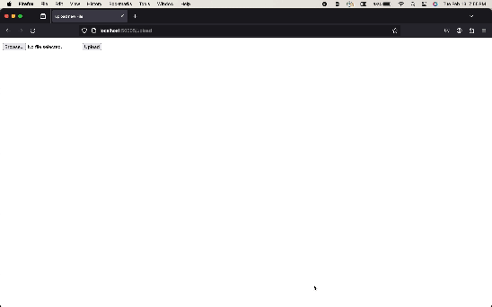

# flask-on-docker

## Overview
In this project, I used the instructions found [here](https://testdriven.io/blog/dockerizing-flask-with-postgres-gunicorn-and-nginx/) to dockerize the Flask app.

Below is a demonstration of what uploading a picture looks like:



## Development

Below are the steps needed the services up:

1. Build the image and run the containers.

```
$ docker-compose up -d --build
```

2. Create the table

```
$ docker-compose exec web python manage.py create_db
```

3. Test it out at http://localhost:4444

4. When finished, bring down the development containers (and the associated volumes with the -v flag)

```
$ docker-compose down -v
```

## Production

This part uses gunicorn and nginx. Below are the instructions:

1. Build the image and run the containers

```
$ docker-compose -f docker-compose.prod.yml up -d --build
```

2. Create the table

```
$ docker-compose -f docker-compose.prod.yml exec web python manage.py create_db
```

3. Test it out at http://localhost:4444

  
4. When finished, bring down the development containers (and the associated volumes with the -v flag)

```
$ docker-compose down -v
```

## Uploading

To upload files, go to http://localhost:4444/upload and upload the file.
After uploading, you can go to http://localhost:4444/media/IMAGE_FILE_NAME 

